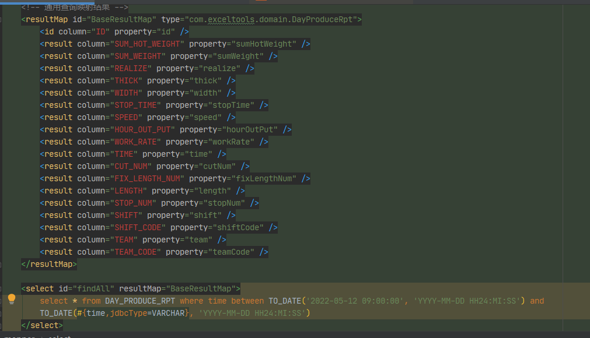
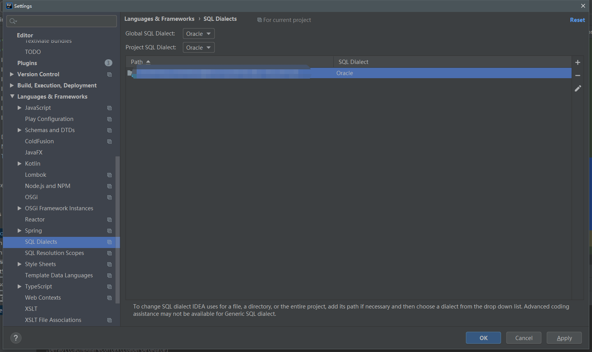
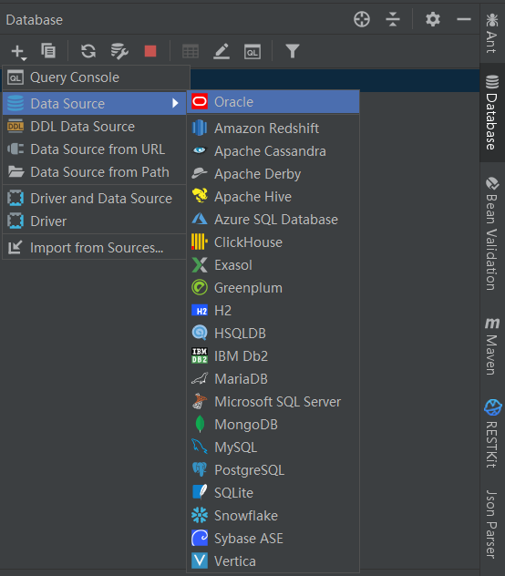
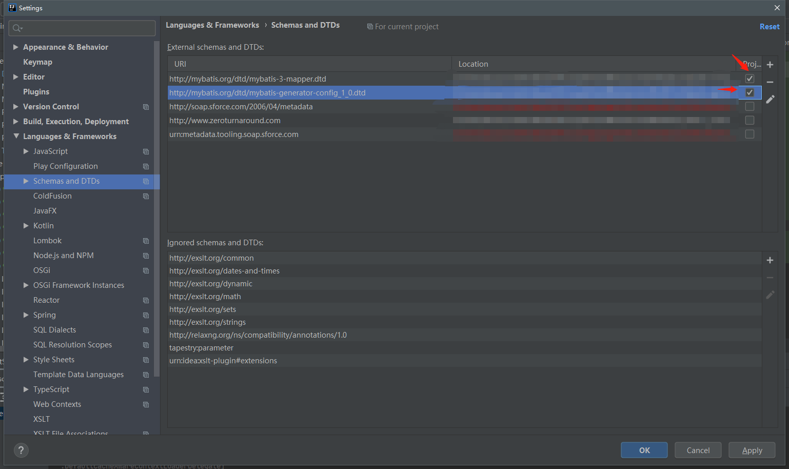
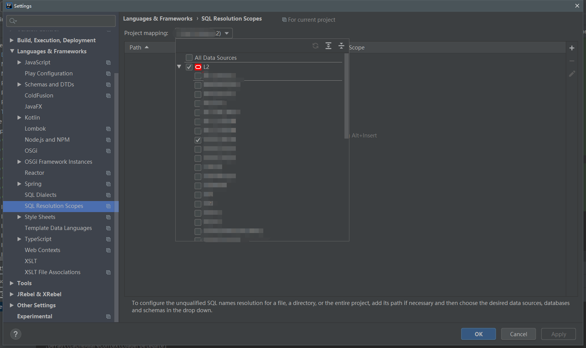

# IDEA-Mybatis
IDEA中mybatis的xml文件没有映射出列字段的问题

## xml字段列为红的解决

打开`File | Settings | Languages & Frameworks | SQL Dialects`，设置Dialect为对应数据库，将项目目录添加到里面

## sql没有对应的提示

配置数据源

`File | Settings | Languages & Frameworks | Schemas and DTDs`勾选图上两个dtd，如果没有需要手动下载并配置

如果上述不行可以加上`File | Settings | Languages & Frameworks | SQL Resolution Scopes`，指定sql的解析范围。

